---
## Front matter
title: "Лабораторная работа №2"
subtitle: "Архитектура компьютера"
author: "Баштованович Анита"

## Generic otions
lang: ru-RU
toc-title: "Содержание"

## Bibliography
bibliography: bib/cite.bib
csl: pandoc/csl/gost-r-7-0-5-2008-numeric.csl

## Pdf output format
toc: true # Table of contents
toc-depth: 2
lof: true # List of figures
lot: true # List of tables
fontsize: 12pt
linestretch: 1.5
papersize: a4
documentclass: scrreprt
## I18n polyglossia
polyglossia-lang:
  name: russian
  options:
	- spelling=modern
	- babelshorthands=true
polyglossia-otherlangs:
  name: english
## I18n babel
babel-lang: russian
babel-otherlangs: english
## Fonts
mainfont: IBM Plex Serif
romanfont: IBM Plex Serif
sansfont: IBM Plex Sans
monofont: IBM Plex Mono
mathfont: STIX Two Math
mainfontoptions: Ligatures=Common,Ligatures=TeX,Scale=0.94
romanfontoptions: Ligatures=Common,Ligatures=TeX,Scale=0.94
sansfontoptions: Ligatures=Common,Ligatures=TeX,Scale=MatchLowercase,Scale=0.94
monofontoptions: Scale=MatchLowercase,Scale=0.94,FakeStretch=0.9
mathfontoptions:
## Biblatex
biblatex: true
biblio-style: "gost-numeric"
biblatexoptions:
  - parentracker=true
  - backend=biber
  - hyperref=auto
  - language=auto
  - autolang=other*
  - citestyle=gost-numeric
## Pandoc-crossref LaTeX customization
figureTitle: "Рис."
tableTitle: "Таблица"
listingTitle: "Листинг"
lofTitle: "Список иллюстраций"
lotTitle: "Список таблиц"
lolTitle: "Листинги"
## Misc options
indent: true
header-includes:
  - \usepackage{indentfirst}
  - \usepackage{float} # keep figures where there are in the text
  - \floatplacement{figure}{H} # keep figures where there are in the text
---

# Цель работы

  Изучить идеологию и применение средств контроля версий. Приобрести практические навыки по работе с системой git.

# Задание

1. Создать отчет по выполнению лабораторной работы в соответствующем каталоге рабочего пространства (labs>lab02>report).
2. Скопировать отчеты по выполнению предыдущих лабораторных работ в соответствующие каталоги созданного рабочего пространства.
3. Загрузить файлы на github.

# Теоретическое введение

Например, в табл. [-@tbl:std-dir] приведено краткое описание стандартных каталогов Unix.

: Описание некоторых каталогов файловой системы GNU Linux {#tbl:std-dir}

| Имя каталога | Описание каталога                                                                                                          |
|--------------|----------------------------------------------------------------------------------------------------------------------------|
| `/`          | Корневая директория, содержащая всю файловую                                                                               |
| `/bin `      | Основные системные утилиты, необходимые как в однопользовательском режиме, так и при обычной работе всем пользователям     |
| `/etc`       | Общесистемные конфигурационные файлы и файлы конфигурации установленных программ                                           |
| `/home`      | Содержит домашние директории пользователей, которые, в свою очередь, содержат персональные настройки и данные пользователя |
| `/media`     | Точки монтирования для сменных носителей                                                                                   |
| `/root`      | Домашняя директория пользователя  `root`                                                                                   |
| `/tmp`       | Временные файлы                                                                                                            |
| `/usr`       | Вторичная иерархия для данных пользователя                                                                                 |

Более подробно про Unix см. в [@tanenbaum_book_modern-os_ru; @robbins_book_bash_en; @zarrelli_book_mastering-bash_en; @newham_book_learning-bash_en].

# Выполнение лабораторной работы

2.4.1. Настройка github
  На сайте https://github.com/ создаем учётную запись и заполняем основные данные. (Рис.1 [fig:001])
  
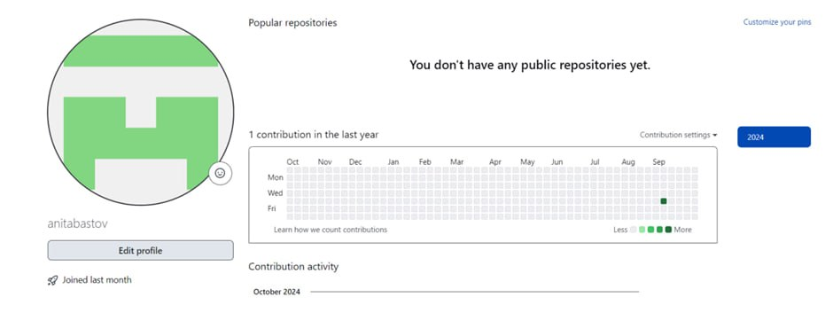{#fig:001 width=100%}

2.4.2. Базовая настройка git
  Сначала сделаем предварительную конфигурацию git. 
  Откроем терминал и введем следующие команды, указав свое имя и email репозитория:(Рис.2 [fig:002])
  
{#fig:002 width=100%}

  При выполнении команды git config происходит изменение текстового файла конфигурации. Добавляем опцию --global для того, чтобы GРис.11 создание репозиторий на основе шаблонаit использовал эти данные в дальнейшем для всех наших действий.
  Настроим utf-8 в выводе сообщений git: (Рис.3 [fig:003])
  
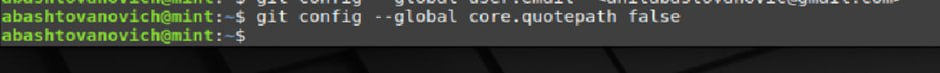{#fig:003 width=100%}

Зададим имя начальной ветки (будем называть её master):(Рис.4 [fig:004])

{#fig:004 width=100%}

Параметр autocrlf (форматирование и пробелы):(Рис.5 [fig:005])

{#fig:005 width=100%}

Параметр safecrlf:(Рис.6 [fig:006])

{#fig:006 width=100%}

2.4.3. Создание SSH ключа 
  Для последующей идентификации на сервере репозиториев нужно сгенерировать пару ключей (приватный и открытый):(Рис.7 [fig:007])

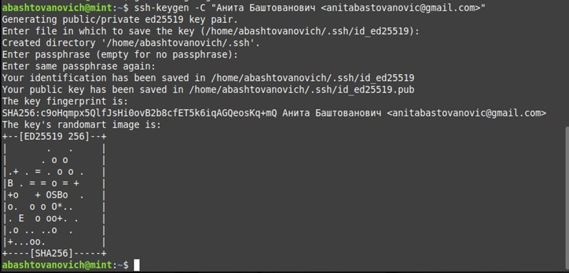{#fig:007 width=100%}

Далее необходимо загрузить сгенерированный открытый (.pub) ключ. 
  Зайдем на сайт http://github.org/ под своей учётной записью и перейдем в меню Setting. 
  После этого выберем в боковом меню SSH and GPG keys и нужно нажать кнопку New SSH key. Скопируем из локальной консоли ключ в буфер обмена (cat ~/.ssh/id_rsa.pub | xclip -sel clip) вставляем ключ в появившееся на сайте поле и указываем для ключа имя (Title).(Рис.8 [fig:008])(Рис.9 [fig:009])

{#fig:008 width=100%}

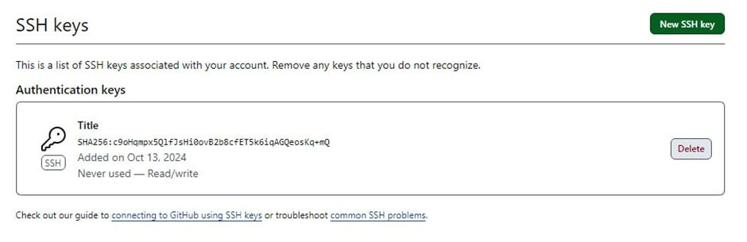{#fig:009 width=100%}

2.4.4. Сознание рабочего пространства и репозитория курса на основе шаблона
  Откройем терминал и создадим каталог для предмета «Архитектура компьютера»:(Рис.10 [fig:010])

{#fig:010 width=100%}

2.4.5. Сознание репозитория курса на основе шаблона
  Репозиторий на основе шаблона создаем через web-интерфейс github. Перейдем на станицу репозитория с шаблоном курса https://github.com/yamadharma/course-directory-student-template. (Рис.11 [fig:011])
  Далее выберите Use this template.

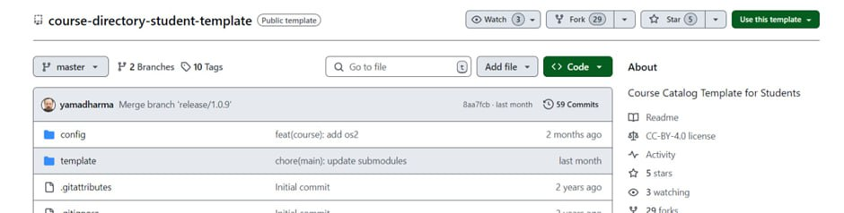{#fig:011 width=100%}

  В открывшемся окне задаём имя репозитория study_2024–2025_arh-pc и создаём репозиторий (кнопка Create repository from template).(Рис.12 [fig:012])

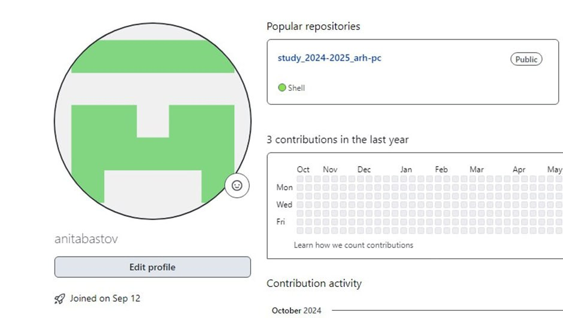{#fig:012 width=100%}

Откроем терминал и перейдём в каталог курса:(Рис.13 [fig:013])

{#fig:013 width=100%}

Клонирую созданный репозиторий:(Рис.14 [fig:014])(Рис.15 [fig:015])

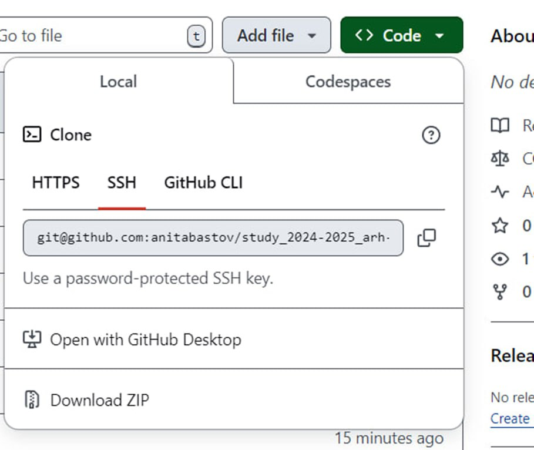{#fig:014 width=100%}

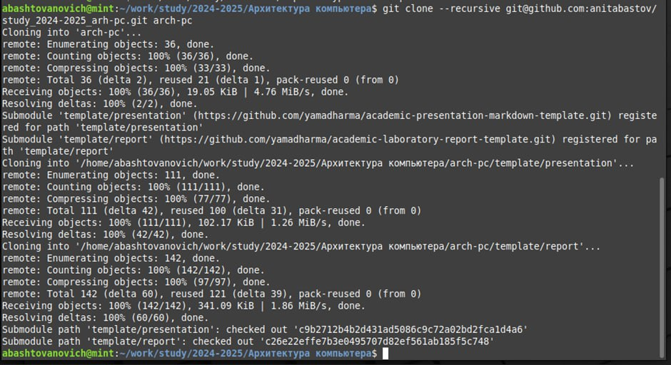{#fig:015 width=100%}

2.4.6 Настройка каталога курса
  Перейдём в каталог курса:(Рис.16 [fig:016])
  
{#fig:016 width=100%}
  
  Удалим лишние каталоги:(Рис.17 [fig:017])
  
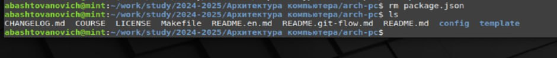{#fig:017 width=100%}
  
  Создадим необходимые каталоги:(Рис.18 [fig:018])

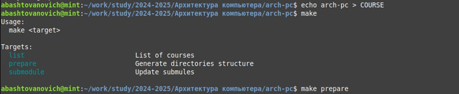{#fig:018 width=100%}

  Отправляем файлы на сервер (прикрепляю не все скриншоты):(Рис.19 [fig:019])(Рис.20 [fig:020])(Рис.21 [fig:021])

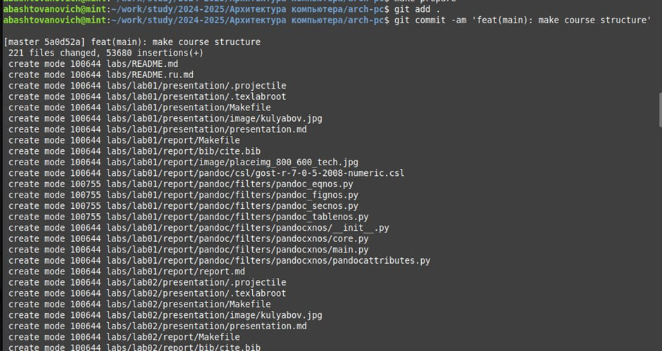{#fig:019 width=100%}

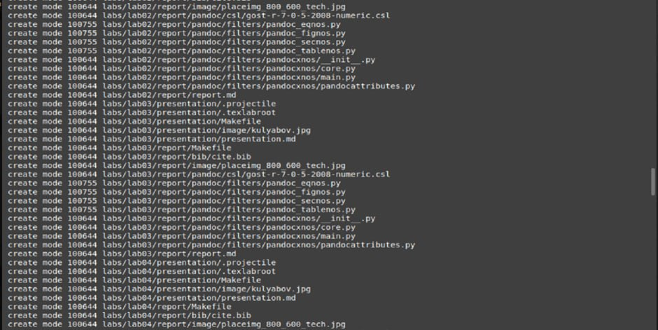{#fig:020 width=100%}

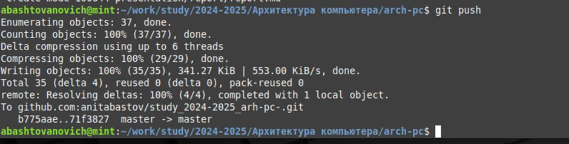{#fig:021 width=100%}

  Проверяем правильность создания иерархии рабочего пространства в локальном репозитории на странице github:(Рис.22 [fig:022])

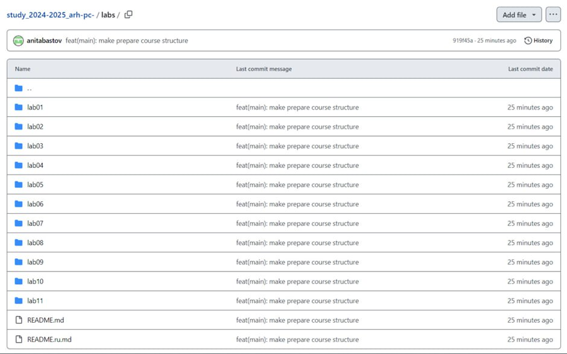{#fig:022 width=100%}

2.5. Задание для самостоятельной работы
  Загрузжаем файлы на github.(Рис.23 [fig:023])(Рис.24 [fig:024])

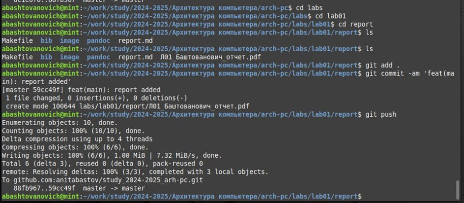{#fig:023 width=100%}

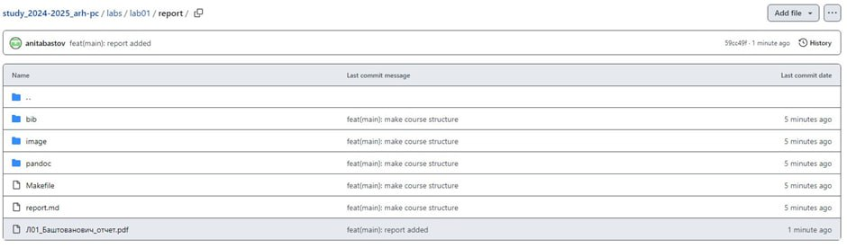{#fig:024 width=100%}

По аналогии поступаем и со второй работой.

# Выводы

  В ходе работы удалось изучить идеологии системы контроля версий git и их применение. Приобрести практические навыки по работе с системой git.

# Список литературы{.unnumbered}

::: {#refs}
:::
