---
## Front matter
title: "Лабораторная работа №4"
subtitle: "Архитектура компьютера"
author: "Баштованович Анита"

## Generic otions
lang: ru-RU
toc-title: "Содержание"

## Bibliography
bibliography: bib/cite.bib
csl: pandoc/csl/gost-r-7-0-5-2008-numeric.csl

## Pdf output format
toc: true # Table of contents
toc-depth: 2
lof: true # List of figures
lot: true # List of tables
fontsize: 12pt
linestretch: 1.5
papersize: a4
documentclass: scrreprt
## I18n polyglossia
polyglossia-lang:
  name: russian
  options:
	- spelling=modern
	- babelshorthands=true
polyglossia-otherlangs:
  name: english
## I18n babel
babel-lang: russian
babel-otherlangs: english
## Fonts
mainfont: IBM Plex Serif
romanfont: IBM Plex Serif
sansfont: IBM Plex Sans
monofont: IBM Plex Mono
mathfont: STIX Two Math
mainfontoptions: Ligatures=Common,Ligatures=TeX,Scale=0.94
romanfontoptions: Ligatures=Common,Ligatures=TeX,Scale=0.94
sansfontoptions: Ligatures=Common,Ligatures=TeX,Scale=MatchLowercase,Scale=0.94
monofontoptions: Scale=MatchLowercase,Scale=0.94,FakeStretch=0.9
mathfontoptions:
## Biblatex
biblatex: true
biblio-style: "gost-numeric"
biblatexoptions:
  - parentracker=true
  - backend=biber
  - hyperref=auto
  - language=auto
  - autolang=other*
  - citestyle=gost-numeric
## Pandoc-crossref LaTeX customization
figureTitle: "Рис."
tableTitle: "Таблица"
listingTitle: "Листинг"
lofTitle: "Список иллюстраций"
lotTitle: "Список таблиц"
lolTitle: "Листинги"
## Misc options
indent: true
header-includes:
  - \usepackage{indentfirst}
  - \usepackage{float} # keep figures where there are in the text
  - \floatplacement{figure}{H} # keep figures where there are in the text
---

# Цель работы

Освоить процедуры компиляции и сборки программ, написанных на ассемблере NASM.

# Задание

1. В каталоге ~/work/arch-pc/lab04 с помощью команды cp создать копию файла hello.asm с именем lab4.asm
2. С помощью любого текстового редактора внести изменения в текст программы в файле lab4.asm так, чтобы вместо Hello world! на экран выводилась строка с фамилией и именем.
3. Оттранслировать полученный текст программы lab4.asm в объектный файл. Выполнить компоновку объектного файла и запустить получившийся исполняемый файл.
4. Скопировать файлы hello.asm и lab4.asm в локальный репозиторий в каталог ~/work/study/2023-2024/"Архитектура компьютера"/arch-pc/labs/lab04/.
Загрузить файлы на Github

# Теоретическое введение

Здесь описываются теоретические аспекты, связанные с выполнением работы.

Например, в табл. [-@tbl:std-dir] приведено краткое описание стандартных каталогов Unix.

: Описание некоторых каталогов файловой системы GNU Linux {#tbl:std-dir}

| Имя каталога | Описание каталога                                                                                                          |
|--------------|----------------------------------------------------------------------------------------------------------------------------|
| `/`          | Корневая директория, содержащая всю файловую                                                                               |
| `/bin `      | Основные системные утилиты, необходимые как в однопользовательском режиме, так и при обычной работе всем пользователям     |
| `/etc`       | Общесистемные конфигурационные файлы и файлы конфигурации установленных программ                                           |
| `/home`      | Содержит домашние директории пользователей, которые, в свою очередь, содержат персональные настройки и данные пользователя |
| `/media`     | Точки монтирования для сменных носителей                                                                                   |
| `/root`      | Домашняя директория пользователя  `root`                                                                                   |
| `/tmp`       | Временные файлы                                                                                                            |
| `/usr`       | Вторичная иерархия для данных пользователя                                                                                 |

Более подробно про Unix см. в [@tanenbaum_book_modern-os_ru; @robbins_book_bash_en; @zarrelli_book_mastering-bash_en; @newham_book_learning-bash_en].

# Выполнение лабораторной работы

Создадим каталог для работы с программами на языке ассемблера NASM.

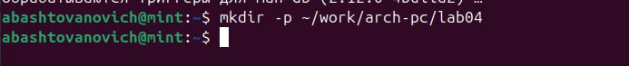{#fig:001 width=100%}

Перейдем в созданный каталог.

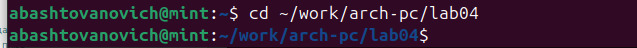{#fig:002 width=100%}

Создадим текстовый файл с именем hello.asm.

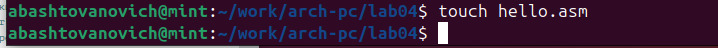{#fig:003 width=100%}

Откроем этот файл с помощью любого текстового редактора, например, gedit.

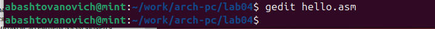{#fig:004 width=100%}

Введем в него следующий текст:

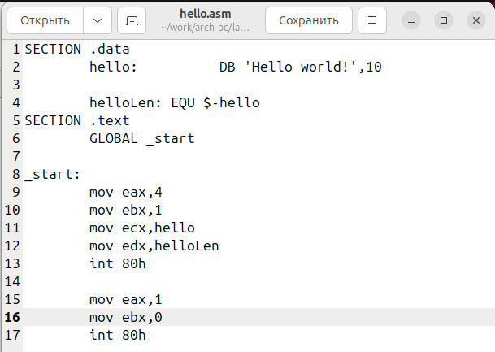{#fig:005 width=100%}

Для компиляции приведённого выше текста программы «Hello World» необходимо написать (nasm -f elf hello.asm). Проверяем наличие нужных файлов с помощью команды ls.

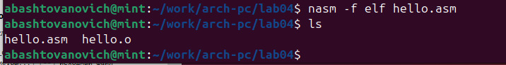{#fig:006 width=100%}

Выполняем следующую команду (nasm -o obj.o -f elf -g -l list.lst hello.asm). Также проверяем наличие необходимых файлов.

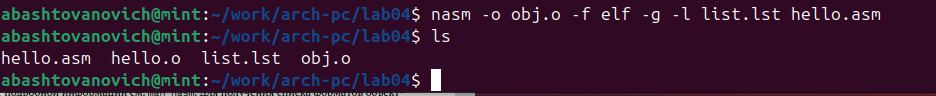{#fig:007 width=100%}

Объектный файл необходимо передать на обработку компоновщику следующим образом.

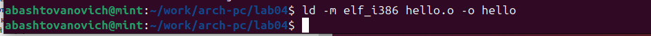{#fig:008 width=100%}

Выполняем следующую команду (ld -m elf_i386 obj.o -o main).

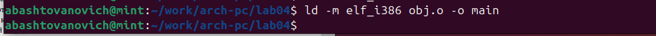{#fig:009 width=100%}

Запустим на выполнение созданный исполняемый файл.
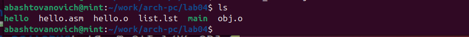{#fig:010 width=100%}
Посмотрим что выведется.
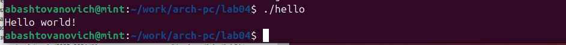{#fig:011 width=100%}

В каталоге ~/work/arch-pc/lab04 с помощью команды cp создайте копию файла
hello.asm с именем lab4.asm
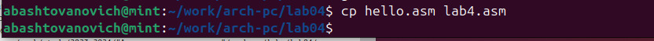{#fig:012 width=100%}

Внесем изменения в текст, запишем теперь свою фимилию и имя.

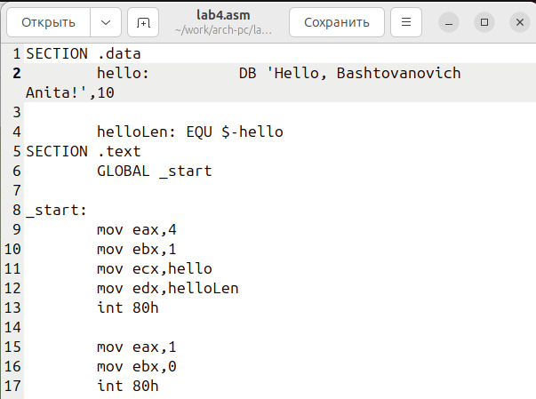{#fig:013 width=100%}

Запустим получившийся исполняемый файл.

 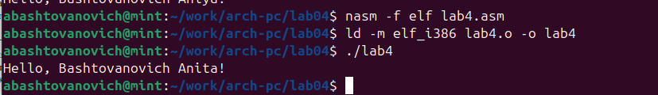{#fig:014 width=100%}
 
# Выводы

Был освоен процесс компиляции и сборки программ, написанных на ассемблере NASM.

# Список литературы{.unnumbered}

::: {#refs}
:::
