---
## Front matter
title: "Лабораторная работа №4"
subtitle: "Архитектура компьютера"
author: "Баштованович Анита"

## Generic otions
lang: ru-RU
toc-title: "Содержание"

## Bibliography
bibliography: bib/cite.bib
csl: pandoc/csl/gost-r-7-0-5-2008-numeric.csl

## Pdf output format
toc: true # Table of contents
toc-depth: 2
lof: true # List of figures
lot: true # List of tables
fontsize: 12pt
linestretch: 1.5
papersize: a4
documentclass: scrreprt
## I18n polyglossia
polyglossia-lang:
  name: russian
  options:
	- spelling=modern
	- babelshorthands=true
polyglossia-otherlangs:
  name: english
## I18n babel
babel-lang: russian
babel-otherlangs: english
## Fonts
mainfont: IBM Plex Serif
romanfont: IBM Plex Serif
sansfont: IBM Plex Sans
monofont: IBM Plex Mono
mathfont: STIX Two Math
mainfontoptions: Ligatures=Common,Ligatures=TeX,Scale=0.94
romanfontoptions: Ligatures=Common,Ligatures=TeX,Scale=0.94
sansfontoptions: Ligatures=Common,Ligatures=TeX,Scale=MatchLowercase,Scale=0.94
monofontoptions: Scale=MatchLowercase,Scale=0.94,FakeStretch=0.9
mathfontoptions:
## Biblatex
biblatex: true
biblio-style: "gost-numeric"
biblatexoptions:
  - parentracker=true
  - backend=biber
  - hyperref=auto
  - language=auto
  - autolang=other*
  - citestyle=gost-numeric
## Pandoc-crossref LaTeX customization
figureTitle: "Рис."
tableTitle: "Таблица"
listingTitle: "Листинг"
lofTitle: "Список иллюстраций"
lotTitle: "Список таблиц"
lolTitle: "Листинги"
## Misc options
indent: true
header-includes:
  - \usepackage{indentfirst}
  - \usepackage{float} # keep figures where there are in the text
  - \floatplacement{figure}{H} # keep figures where there are in the text
---

# Цель работы

Приобрести практические навыки работы в Midnight Commander. Освоить инструкцию
языка ассемблера mov и int.

# Задание

1. Создайте копию файла lab5-1.asm. Внесите изменения в программу (без использования внешнего файла in_out.asm), так чтобы она работала по следующему алгоритму:
• вывести приглашение типа “Введите строку:”;
• ввести строку с клавиатуры;
• вывести введённую строку на экран.
2. Получите исполняемый файл и проверьте его работу. На приглашение ввести строку
введите свою фамилию.
3. Создайте копию файла lab5-2.asm. Исправьте текст программы с использование подпрограмм из внешнего файла in_out.asm, так чтобы она работала по следующему
алгоритму:
• вывести приглашение типа “Введите строку:”;
• ввести строку с клавиатуры;
• вывести введённую строку на экран                                                                            4. Создайте исполняемый файл и проверьте его работу.

# Теоретическое введение

Здесь описываются теоретические аспекты, связанные с выполнением работы.

Например, в табл. [-@tbl:std-dir] приведено краткое описание стандартных каталогов Unix.

: Описание некоторых каталогов файловой системы GNU Linux {#tbl:std-dir}

| Имя каталога | Описание каталога                                                                                                          |
|--------------|----------------------------------------------------------------------------------------------------------------------------|
| `/`          | Корневая директория, содержащая всю файловую                                                                               |
| `/bin `      | Основные системные утилиты, необходимые как в однопользовательском режиме, так и при обычной работе всем пользователям     |
| `/etc`       | Общесистемные конфигурационные файлы и файлы конфигурации установленных программ                                           |
| `/home`      | Содержит домашние директории пользователей, которые, в свою очередь, содержат персональные настройки и данные пользователя |
| `/media`     | Точки монтирования для сменных носителей                                                                                   |
| `/root`      | Домашняя директория пользователя  `root`                                                                                   |
| `/tmp`       | Временные файлы                                                                                                            |
| `/usr`       | Вторичная иерархия для данных пользователя                                                                                 |

Более подробно про Unix см. в [@tanenbaum_book_modern-os_ru; @robbins_book_bash_en; @zarrelli_book_mastering-bash_en; @newham_book_learning-bash_en].

# Выполнение лабораторной работы

Откройте Midnight Commander.
Перейдем в каталог ~/work/arch-pc созданный
при выполнении лабораторной работы №4.

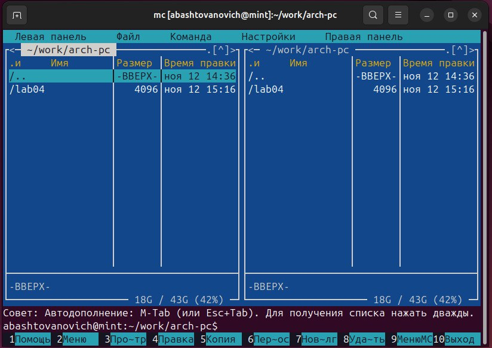{#fig:001 width=100%}

С помощью функциональной клавиши F7 создадим папку lab05.

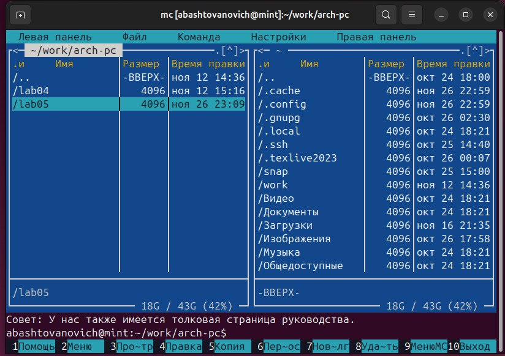{#fig:002 width=100%}

Перейдем в созданный каталог.

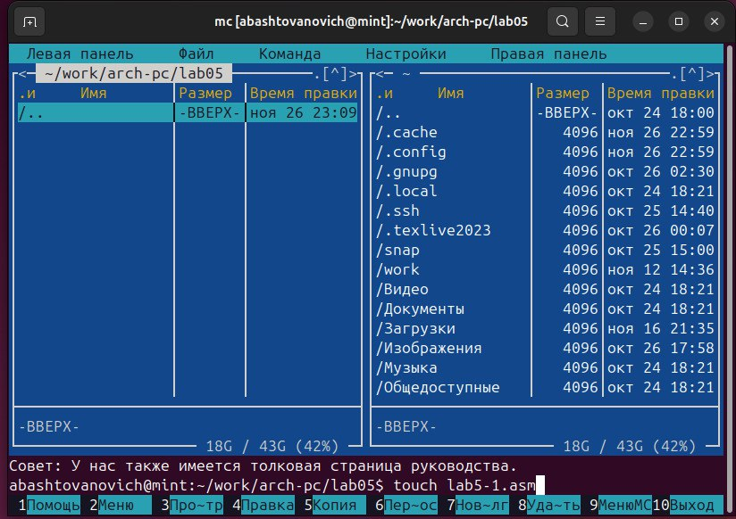{#fig:003 width=100%}

Пользуясь строкой ввода и командой touch создадим файл lab5-1.asm

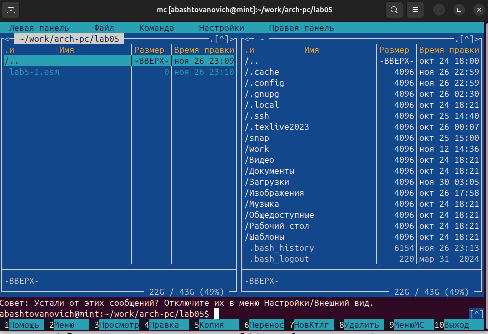{#fig:004 width=100%}

Введем текст программы из листинга 5.1, сохраним изменения и закроем файл.

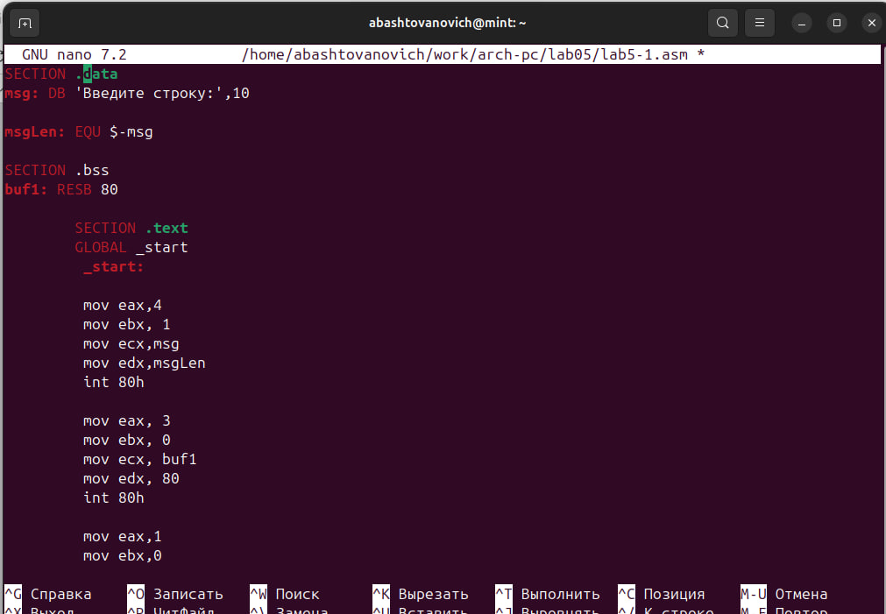{#fig:005 width=100%}

С помощью функциональной клавиши F3 откроем файл lab5-1.asm для просмотра.
Убедимся, что файл содержит текст программы.

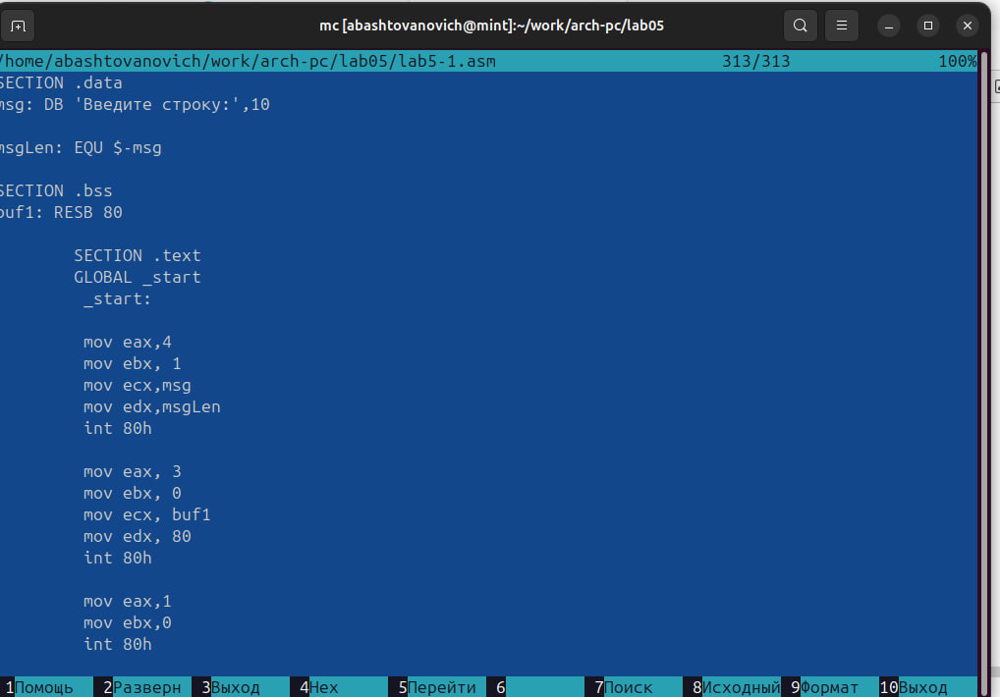{#fig:006 width=100%}

Оттранслируем текст программы lab5-1.asm в объектный файл. Выполним компоновку объектного файла и запустим получившийся исполняемый файл. Программа выводит строку 'Введите строку:' и ожидает ввода с клавиатуры. На запрос вводим ФИО.

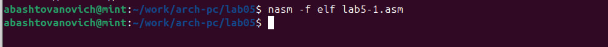{#fig:007 width=100%}

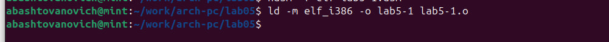{#fig:008 width=100%}

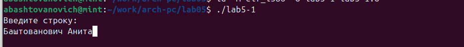{#fig:009 width=100%}

Скачиваем файл in_out.asm со страницы курса в ТУИС.

Подключаемый файл in_out.asm должен лежать в том же каталоге, что и файл с программой, в которой он используется.

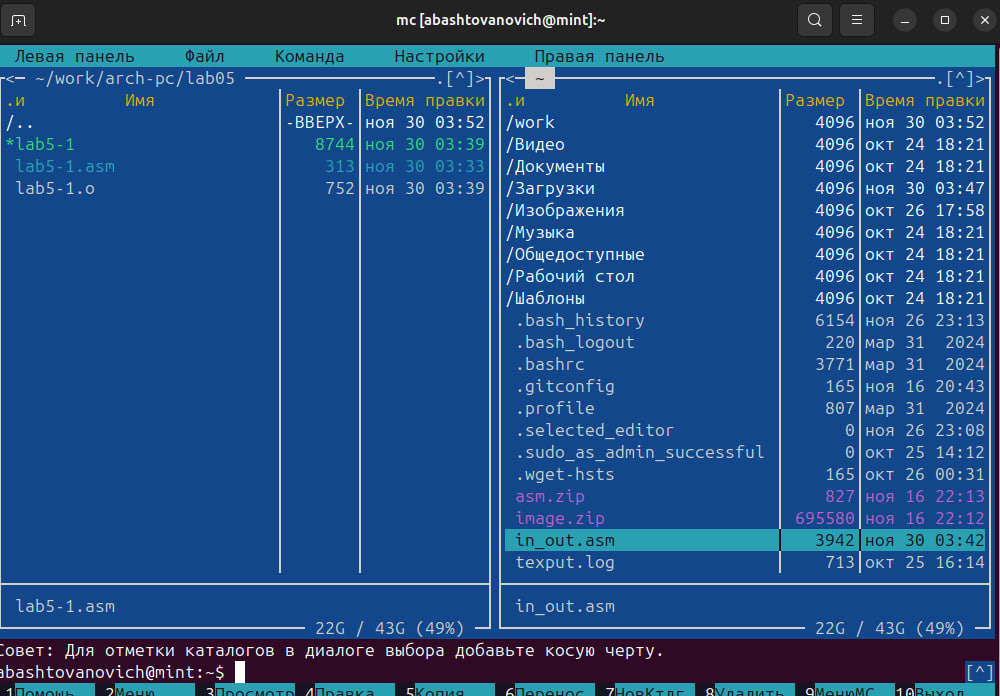{#fig:010 width=100%}

В одной из панелей mc откроем каталог с файлом lab5-1.asm. В другой панели каталог
со скаченным файлом in_out.asm (для перемещения между панелями используем Tab ).
Скопируем файл in_out.asm в каталог с файлом lab5-1.asm с помощью функциональной клавиши F5

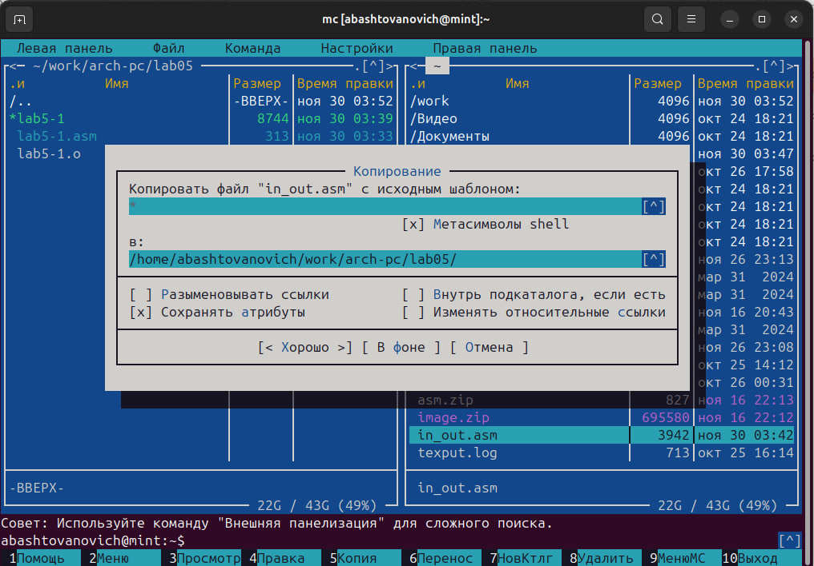{#fig:011 width=100%}

С помощью функциональной клавиши F6 создадим копию файла lab5-1.asm с именем lab5-2.asm. Выделим файл lab5-1.asm, нажмем клавишу F6 , введем имя файла
lab5-2.asm и нажмем клавишу Enter.

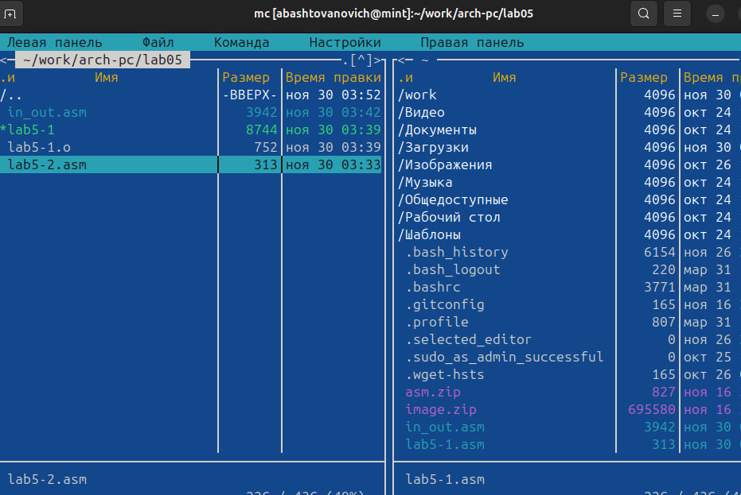{#fig:012 width=100%}

Исправим текст программы в файле lab5-2.asm с использованием подпрограмм из
внешнего файла in_out.asm (используем подпрограммы sprintLF, sread и quit) в
соответствии с листингом 5.2. Создадим исполняемый файл и проверим его работу.

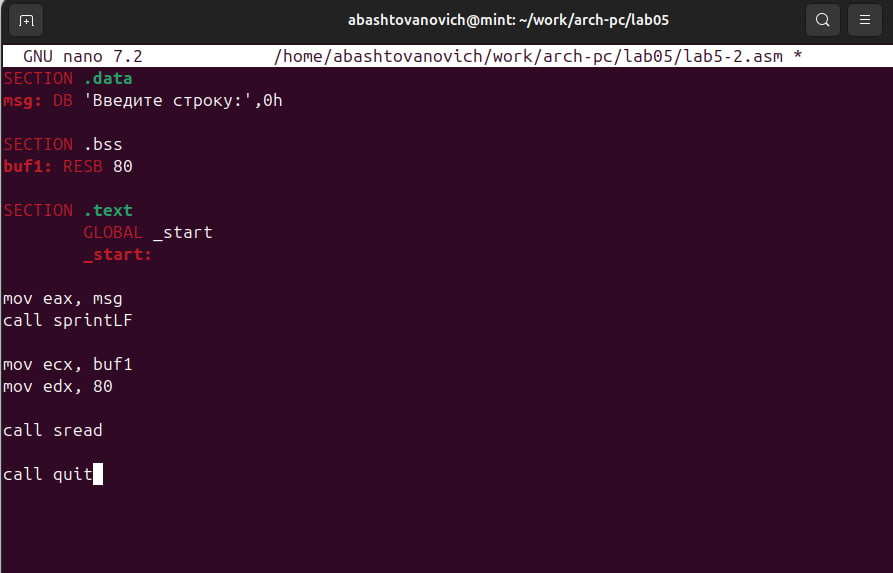{#fig:013 width=100%}

Создадим копию файла lab5-1.asm. Внесем изменения в программу (без использования внешнего файла in_out.asm), так чтобы она работала по следующему алгоритму:
• вывести приглашение типа “Введите строку:”;
• ввести строку с клавиатуры;
• вывести введённую строку на экран.

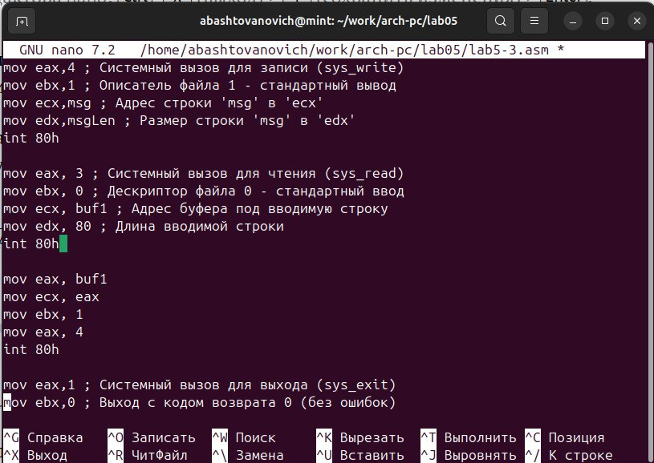{#fig:014 width=100%}

Получим исполняемый файл и проверим его работу. На приглашение ввести строку - введем свою фамилию.

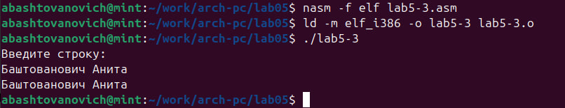{#fig:015 width=100%}

Создадим копию файла lab5-2.asm. Исправим текст программы с использование подпрограмм из внешнего файла in_out.asm, так чтобы она работала по следующему
алгоритму:
• вывести приглашение типа “Введите строку:”;
• ввести строку с клавиатуры;
• вывести введённую строку на экран 

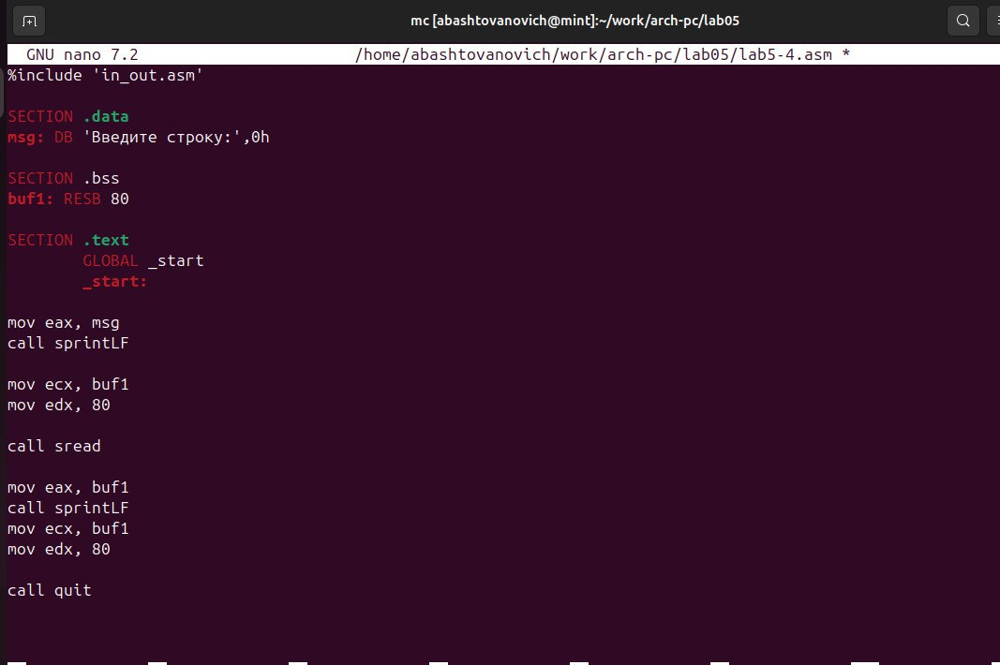{#fig:016 width=100%}

Создайте исполняемый файл и проверьте его работу.

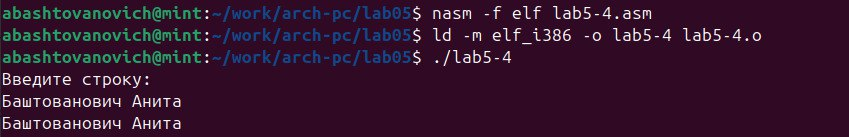{#fig:017 width=100%}

# Выводы

Приобретены практические навыки работы в Midnight Commander. Освоенна инструкция
языка ассемблера mov и int.

# Список литературы{.unnumbered}

::: {#refs}
:::
