---
## Front matter
title: "Лабораторная работа №6"
subtitle: "Архитектура компьютера"
author: "Баштованович Анита"

## Generic otions
lang: ru-RU
toc-title: "Содержание"

## Bibliography
bibliography: bib/cite.bib
csl: pandoc/csl/gost-r-7-0-5-2008-numeric.csl

## Pdf output format
toc: true # Table of contents
toc-depth: 2
lof: true # List of figures
lot: true # List of tables
fontsize: 12pt
linestretch: 1.5
papersize: a4
documentclass: scrreprt
## I18n polyglossia
polyglossia-lang:
  name: russian
  options:
	- spelling=modern
	- babelshorthands=true
polyglossia-otherlangs:
  name: english
## I18n babel
babel-lang: russian
babel-otherlangs: english
## Fonts
mainfont: IBM Plex Serif
romanfont: IBM Plex Serif
sansfont: IBM Plex Sans
monofont: IBM Plex Mono
mathfont: STIX Two Math
mainfontoptions: Ligatures=Common,Ligatures=TeX,Scale=0.94
romanfontoptions: Ligatures=Common,Ligatures=TeX,Scale=0.94
sansfontoptions: Ligatures=Common,Ligatures=TeX,Scale=MatchLowercase,Scale=0.94
monofontoptions: Scale=MatchLowercase,Scale=0.94,FakeStretch=0.9
mathfontoptions:
## Biblatex
biblatex: true
biblio-style: "gost-numeric"
biblatexoptions:
  - parentracker=true
  - backend=biber
  - hyperref=auto
  - language=auto
  - autolang=other*
  - citestyle=gost-numeric
## Pandoc-crossref LaTeX customization
figureTitle: "Рис."
tableTitle: "Таблица"
listingTitle: "Листинг"
lofTitle: "Список иллюстраций"
lotTitle: "Список таблиц"
lolTitle: "Листинги"
## Misc options
indent: true
header-includes:
  - \usepackage{indentfirst}
  - \usepackage{float} # keep figures where there are in the text
  - \floatplacement{figure}{H} # keep figures where there are in the text
---

# Цель работы

Освоить арифметические инструкции языка ассемблера NASM.

# Задание

Здесь приводится описание задания в соответствии с рекомендациями
методического пособия и выданным вариантом.

# Теоретическое введение

Здесь описываются теоретические аспекты, связанные с выполнением работы.

Например, в табл. [-@tbl:std-dir] приведено краткое описание стандартных каталогов Unix.

: Описание некоторых каталогов файловой системы GNU Linux {#tbl:std-dir}

| Имя каталога | Описание каталога                                                                                                          |
|--------------|----------------------------------------------------------------------------------------------------------------------------|
| `/`          | Корневая директория, содержащая всю файловую                                                                               |
| `/bin `      | Основные системные утилиты, необходимые как в однопользовательском режиме, так и при обычной работе всем пользователям     |
| `/etc`       | Общесистемные конфигурационные файлы и файлы конфигурации установленных программ                                           |
| `/home`      | Содержит домашние директории пользователей, которые, в свою очередь, содержат персональные настройки и данные пользователя |
| `/media`     | Точки монтирования для сменных носителей                                                                                   |
| `/root`      | Домашняя директория пользователя  `root`                                                                                   |
| `/tmp`       | Временные файлы                                                                                                            |
| `/usr`       | Вторичная иерархия для данных пользователя                                                                                 |

Более подробно про Unix см. в [@tanenbaum_book_modern-os_ru; @robbins_book_bash_en; @zarrelli_book_mastering-bash_en; @newham_book_learning-bash_en].

# Выполнение лабораторной работы

Создадим каталог для программам лабораторной работы №6, перейдем в него и создадим файл lab6-1.asm:(рис.1 [-@fig:001]).

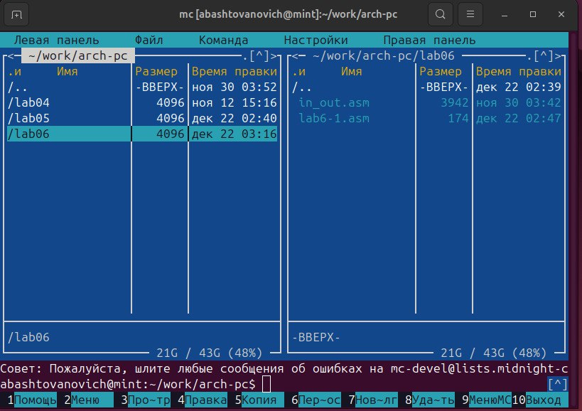{#fig:001 width=100%}

Рассмотрим примеры программ вывода символьныхчисленных значений. Программы будут выводить значения записанные в регистр eax.

Введем в файл lab6-1.asm текст программы из листинга 6.1. В данной программе в регистр eax записывается символ 6 (mov eax,'6'), в регистр ebx символ 4 (mov ebx,'4').
Далее к значению в регистре eax прибавляем значение регистра ebx (add eax,ebx, результат сложения запишется в регистр eax). Далее выводим результат. Так как для работы функции sprintLF в регистр eax должен быть записан адрес, необходимо использовать дополнительную переменную. Для этого запишем значение регистра eax в переменную buf1 (mov [buf1],eax), а затем запишем адрес переменной buf1 в регистр eax (mov eax,buf1) и вызовем функцию sprintLF.(рис.2 [-@fig:002]).

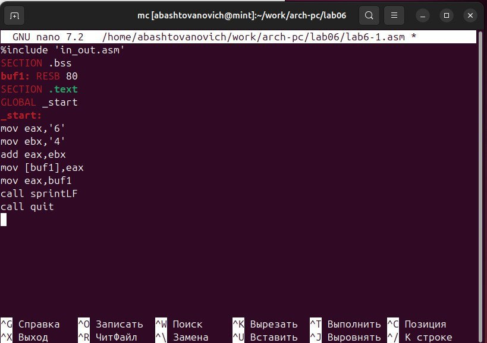{#fig:002 width=100%}

Создадим исполняемый файл и запустим его.(рис.3 [-@fig:003]).

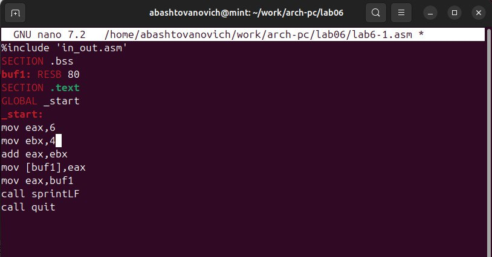{#fig:003 width=100%}

В данном случае при выводе значения регистра eax мы ожидаем увидеть число 10. Однако результатом будет символ j. Это происходит потому, что код символа 6 равен 00110110 в двоичном представлении (или 54 в десятичном представлении), а код символа 4 00110100(52). Команда add eax,ebx запишет в регистр eax сумму кодов – 01101010 (106), что в свою очередь является кодом символа j (см. таблицу ASCII в приложении).

Далее изменим текст программы и вместо символов, запишем в регистры числа. Исправим текст программы (Листинг 6.1) следующим образом: заменим строки(рис.4 [-@fig:004]).

{#fig:004 width=100%}

Создадим исполняемый файл и запустим его.(рис.5 [-@fig:005]).

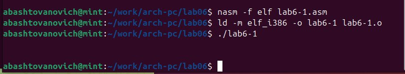{#fig:005 width=100%}

Как и в предыдущем случае при исполнении программы мы не получим число 10. В данном случае выводится символ с кодом 10. Это символ конца строки (возврат каретки). В консоле он не отображается, но добавляет пустую строку.

Как отмечалось выше, для работы с числами в файле in_out.asm реализованы подпрограммы для преобразования ASCII символов в числа и обратно. Преобразуем текст
программы из Листинга 6.1 с использованием этих функций.

Создадим файл lab6-2.asm в каталоге ~/work/arch-pc/lab06 и введем в него текст программы из листинга 6.2.(рис.6 [-@fig:006]).

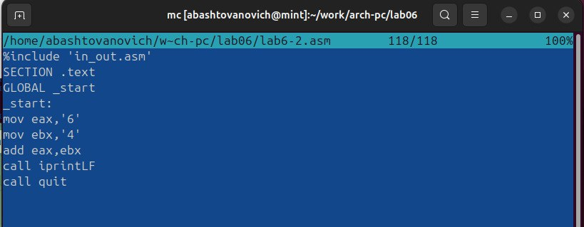{#fig:006 width=100%}

Создадим исполняемый файл и запустим его.(рис.7 [-@fig:007]).

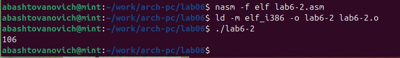{#fig:007 width=100%}

В результате работы программы мы получим число 106. В данном случае, как и в первом, команда add складывает коды символов ‘6’ и ‘4’ (54+52=106). Однако, в отличии от программы из листинга 6.1, функция iprintLF позволяет вывести число, а не символ, кодом которого является это число.

Аналогично предыдущему примеру изменим символы на числа. Заменим строки и создадим исполняемый файл и запустим его.(рис.8 [-@fig:008]).

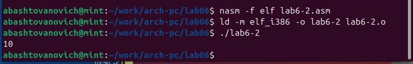{#fig:008 width=100%}

Функция iprintLF позволяет вывести число и операндами были числа (а не коды символов). Поэтому получаем число 10.

Заменим функцию iprintLF на iprint. Создадим исполняемый файл и запустим его. (рис.9 [-@fig:009]).

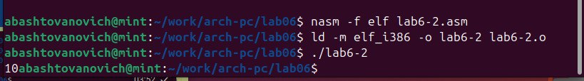{#fig:009 width=100%}

Вывод отличается тем, что нет переноса строки.

В качестве примера выполнения арифметических операций в NASM приведем программу вычисления арифметического выражения 𝑓(𝑥) = (5 ∗ 2 + 3)/3.

Создадим файл lab6-3.asm в каталоге ~/work/arch-pc/lab06:(рис.10 [-@fig:010]).

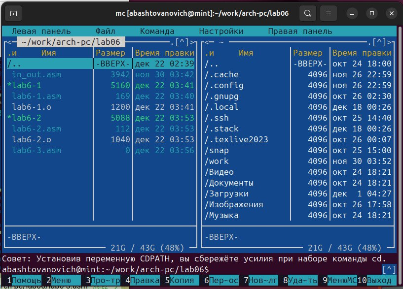{#fig:010 width=100%}

Внимательно изучим текст программы из листинга 6.3 и введем в lab6-3.asm.(рис.11 [-@fig:011]).

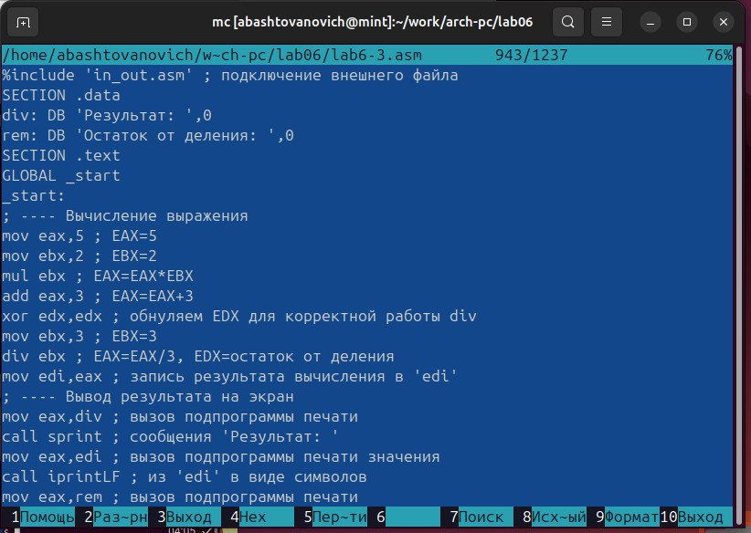{#fig:011 width=100%}

Создадим исполняемый файл и запустим его.(рис.12 [-@fig:012]).

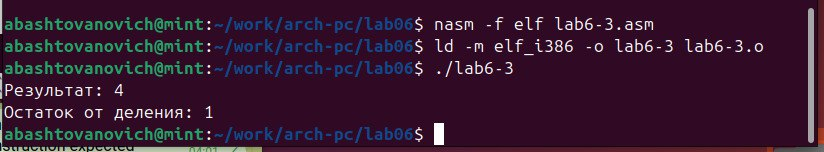{#fig:012 width=100%}

Изменим текст программы для вычисления выражения 𝑓(𝑥) = (4 ∗ 6 + 2)/5.(рис.13 [-@fig:013]).

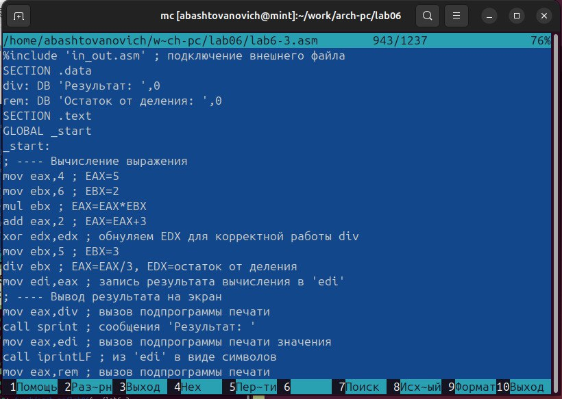{#fig:013 width=100%}

Создадим исполняемый файл и запустим его.(рис.14 [-@fig:014]).

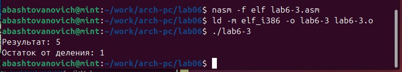{#fig:014 width=100%}

В качестве другого примера рассмотрим программу вычисления варианта задания по номеру студенческого билета, работающую по следующему алгоритму:
• вывести запрос на введение № студенческого билета
• вычислить номер варианта по формуле: (𝑆𝑛 mod 20) + 1, где 𝑆𝑛 – номер студенческого билета (В данном случае 𝑎 mod 𝑏 – это остаток от деления 𝑎 на 𝑏).
• вывести на экран номер варианта.

В данном случае число, над которым необходимо проводить арифметические операции, вводится с клавиатуры. Как отмечалось выше ввод с клавиатуры осуществляется в символьном виде и для корректной работы арифметических операций в NASM символы необходимо преобразовать в числа. Для этого может быть использована функция atoi из файла
in_out.asm.

Создадим файл variant.asm в каталоге ~/work/arch-pc/lab06:(рис.15 [-@fig:015]).

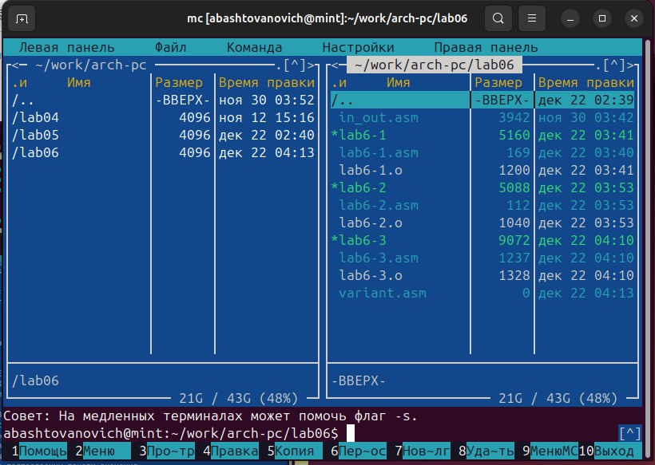{#fig:015 width=100%}

Внимательно изучим текст программы из листинга 6.4 и введем в файл variant.asm.(рис.16 [-@fig:016]).

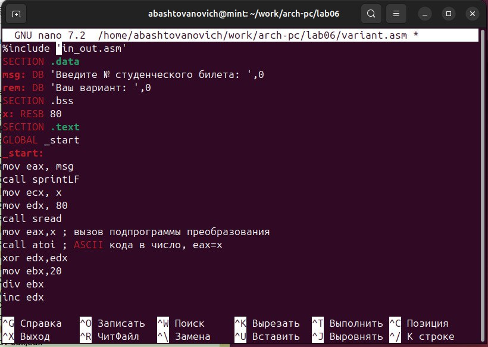{#fig:016 width=100%}

Создадим исполняемый файл и запустим его. (рис.17 [-@fig:017]).

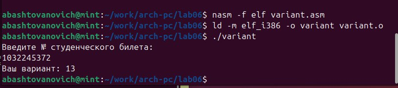{#fig:017  width=100%}

# Ответы на вопросы 
1. Какие строки листинга отвечают за вывод на экран сообщения ‘Ваш вариант:’?

- Инструкция "mov eax, rem" перекладывает значение переменной с фразой ‘Ваш вариант:’ в регистр eax.

- Инструкция "call sprint" вызывает подпрограмму для вывода строки.

2. Для чего используется следующие инструкции?
- Инструкция "mov ecx, x" используется для перемещения значения переменной x в регистр ecx.

- Инструкция "mov edx, 80" используется для перемещения значения 80 в регистр edx.

- Инструкция "call sread" вызывает подпрограмму для считывания значения студенческого билета из консоли

3. Для чего используется инструкция “call atoi”?
- Инструкция “call atoi” используется для преобразования введенных символов в числовой формат.

4. Какие строки листинга отвечают за вычисления варианта?
- Инструкция "xor edx, edx" обнуляет регистр edx.

- Инструкция "mov ebx, 20" записывает значение 20 в регистр ebx.

- Инструкция "div ebx" выполняет деление номера студенческого билета на 20.

- Инструкция "inc edx" увеличивает значение регистра edx на 1.

Здесь происходит деление номера студ билета на 20. В регистре edx хранится остаток, к нему прибавляется 1.

5. В какой регистр записывается остаток от деления при выполнении инструкции “div ebx”?
- Остаток от деления записывается в регистр edx.

6. Для чего используется инструкция “inc edx”?
- Инструкция “inc edx” используется для увеличения значения в регистре edx на 1, согласно формуле вычисления варианта.

7. Какие строки листинга отвечают за вывод на экран результата вычислений?
- Инструкция "mov eax, edx" перекладывает результат вычислений в регистр eax.

- Инструкция "call iprintLF" вызывает подпрограмму для вывода значения на экран.

# Задание для самостоятельной работы

Напишем программу вычисления выражения 𝑦 = 𝑓(𝑥). Программа должна выводить выражение для вычисления, выводить запрос на ввод значения 𝑥, вычислять заданное выражение в зависимости от введенного 𝑥, выводить результат вычислений.

Мой вид функции ВАРИАНТ 13 - 𝑓(𝑥) = (8𝑥 + 6) ⋅ 10 проверить для 𝑥1 = 1 и 𝑥2 = 4.(рис.18 [-@fig:018]).

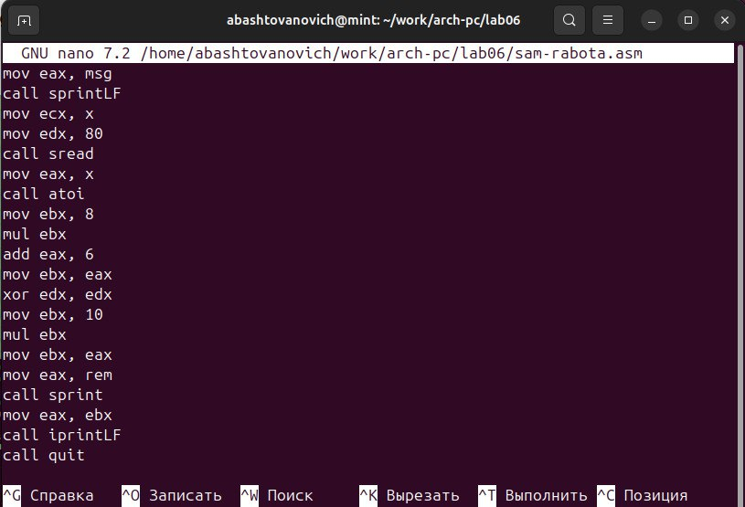{#fig:018 width=100%}

Создадим исполняемый файл и запустим его для значения 𝑥1 = 1. (рис.19 [-@fig:019]).

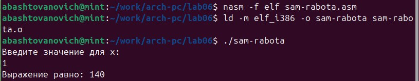{#fig:019 width=100%}

Создадим исполняемый файл и запустим его для значения 𝑥2 = 4. (рис.20 [-@fig:020]).

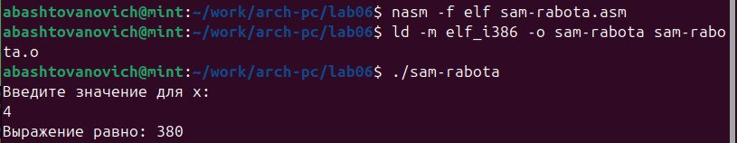{#fig:020 width=100%}

# Выводы

Освоенны арифметические инструкции языка ассемблера NASM.

# Список литературы{.unnumbered}

::: {#refs}
:::
